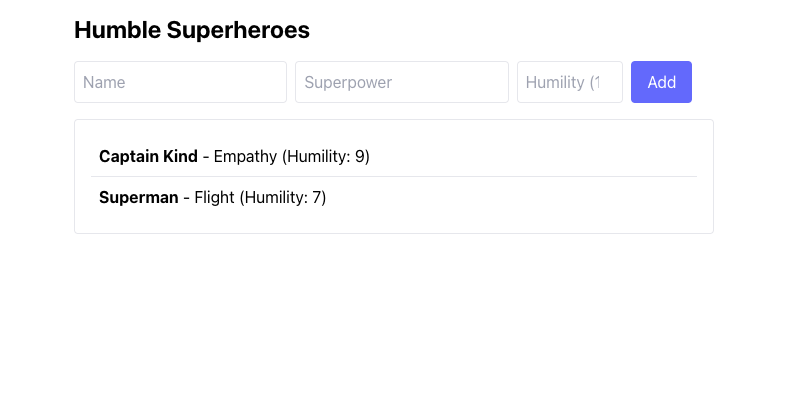

# Humble Superhero API

## Overview

The **Humble Superhero API** allows users to add and retrieve superheroes based on their humility scores. It demonstrates best practices in API design using **NestJS**, **DTO validation**, **unit testing**, and **Swagger for API documentation**.

## Features

- Add superheroes with a name, superpower, and humility score (1-10).
- Retrieve superheroes sorted by humility score (highest first).
- Swagger API documentation.
- Unit tests with Jest.

## Tech Stack

- **Node.js** (NestJS framework)
- **TypeScript**
- **Jest** (unit testing)
- **Swagger** (API documentation)

## Getting Started

### Prerequisites

- Node.js v16+
- npm or yarn

### Installation

Clone the repository and install dependencies:

```sh
yarn install
```

### Running the Application

Start the NestJS server:

```sh
yarn start:dev
```

The API will be available at:

- **Base URL:** `http://localhost:3000`
- **Swagger Docs:** `http://localhost:3000/swagger`

## API Endpoints

### Create a Superhero

**POST** `/superheroes`

#### Request Body

```json
{
  "name": "Captain Kind",
  "superpower": "Empathy",
  "humilityScore": 9
}
```

#### Response

```json
{
  "status": true,
  "message": "Superhero created successfully",
  "data": {
    "id": "6f498a14-fedf-4caf-bcca-8b1de2366308",
    "name": "Captain Kind",
    "superpower": "Empathy",
    "humilityScore": 9
  }
}
```

### Get Superheroes (Sorted by Humility)

**GET** `/superheroes`

#### Response

```json
{
  "status": true,
  "message": "Superheroes retrieved successfully",
  "data": [
    {
      "id": "6f498a14-fedf-4caf-bcca-8b1de2366308",
      "name": "Captain Kind",
      "superpower": "Empathy",
      "humilityScore": 9
    }
  ]
}
```

## Swagger API Documentation

Swagger is enabled for easy API exploration.

- Visit: `http://localhost:3000/swagger`
- Available in `src/main.ts` using `@nestjs/swagger`:
- Postman collection: `https://localhost:3000//swagger-json`

## Testing

Run unit tests:

```sh
yarn test
```

## Frontend
Run the frontend application:

```sh
yarn start:frontend
```


## Collaboration
To improve and expand this project, here's how I would collaborate with a teammate:

1. **Feature Development & Code Reviews**: We’d use GitHub feature branches and pull requests. One developer works on the backend, while another refines the frontend, ensuring clear commit messages and detailed PR descriptions.
2. **API Contract Agreement**: We’d define a clear API contract in a shared document or via Swagger to ensure frontend-backend alignment.
3. **Testing & QA**: One person writes unit tests while another reviews and runs integration tests to catch issues early.
4. **Refactoring & Optimization**: Code reviews will focus on maintainability, security, and performance improvements.
5. **Real-Time Collaboration**: Regular check-ins via Slack or a task management tool (JIRA/Trello) to track progress and blockers.

## If I Had More Time
If I had more time, I would:

- **Add a Database**: Replace in-memory storage with a database like PostgreSQL or MongoDB for persistence.
- **Enhance UI/UX**: Improve the frontend with animations, better error handling, and a real-time WebSocket update system.
- **User Authentication**: Implement authentication to allow users to manage their own superhero lists.
- **More Testing**: Increase test coverage with integration tests and end-to-end tests using Cypress.
- **Deployment & CI/CD**: Set up a CI/CD pipeline for automatic testing and deployment to a cloud provider like Vercel (for frontend) and Render (for backend).
- **Performance Optimization**: Implement caching (Redis) and rate-limiting for better API efficiency.

This would make the project production-ready while maintaining scalability and maintainability.

---
